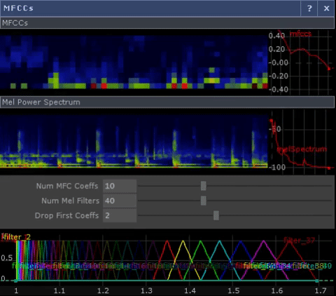

# MFCCs for TouchDesigner
This computes the Mel power spectrogram and MFCCs in real time inside TouchDesigner.    
No external python liraries are needed.
The MFCC computation relies on the metod using the inverse FFT (instead of the discrete cosine transform) since TouchDesigner has no bult-in discrete cosine transform.    
This repository also contains a Jupyter Notebook demonstrating the method. To run the notebook librosa is required (but not to run the COMP in TD).
References can also be found in the Jupyter notebook.

